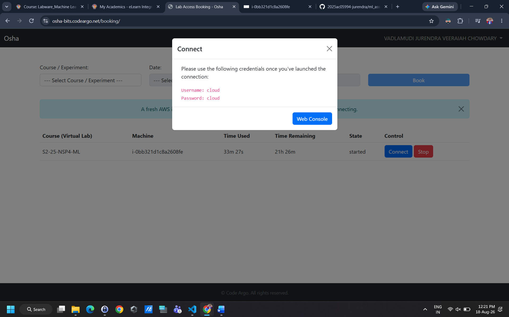
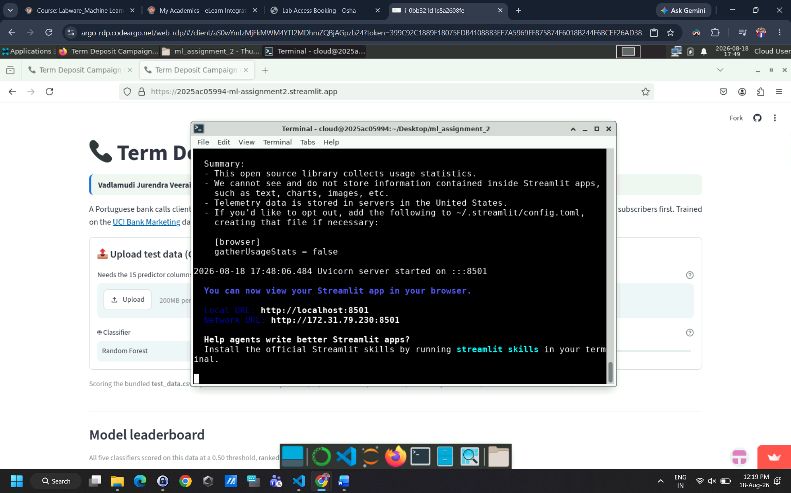
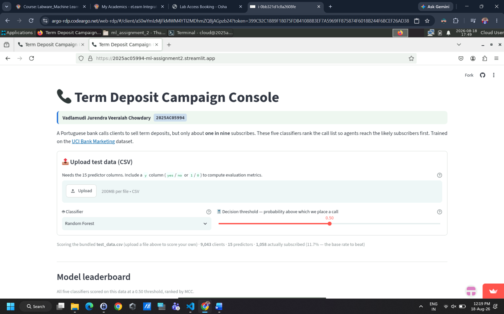

# Bank Marketing — Term Deposit Subscription Prediction

**Vadlamudi Jurendra Veeraiah Chowdary · 2025AC05994**

---

## a. Problem statement

A Portuguese retail bank runs outbound telemarketing campaigns to sell **term deposits**, but only
about one client in nine subscribes — so most calls produce no revenue while still costing agent
time.

This is a **binary classification** problem: using only information available *before* a call is
placed (client demographics, existing banking relationship, and previous campaign history),
predict whether a client will subscribe (`y = yes`) or not (`y = no`). A good model lets the bank
rank its call list and contact the most promising clients first.

Because the positive class is rare and is the one that matters commercially, the two error types
cost differently: calling someone who declines wastes a few minutes, while failing to call someone
who would have subscribed loses the sale entirely. **Recall and MCC therefore matter more here
than raw accuracy.**

---

## b. Dataset description

| Property | Value |
|---|---|
| Source | [UCI ML Repository — Bank Marketing](https://archive.ics.uci.edu/dataset/222/bank+marketing) Moro, Cortez & Rita, 2014 |
| File used | `bank-full.csv` |
| Instances | **45,211**  |
| Features | 15 input features - Dropped one leaky feature |
| Target | `y` — did the client subscribe to a term deposit? |
| Class balance | 39,922 `no` (88.3%) / 5,289 `yes` (**11.7%**) |
| Missing values | None (unknown categoricals appear as the string `"unknown"`) |
| Duplicate rows | None |

### Features used (15)

| Group | Features |
|---|---|
| Client profile | `age`, `job`, `marital`, `education`, `default`, `balance`, `housing`, `loan` |
| Current campaign | `contact`, `day`, `month`, `campaign` |
| Previous campaign | `pdays` (-1 = never contacted), `previous`, `poutcome` |

### Excluded feature — `duration`

The dataset contains a 16th predictor, `duration` (length of the call in seconds), which was
**dropped**. The UCI documentation warns that it *"is not known before a call is
performed"* and *"should be discarded if the intention is to have a realistic predictive model."*

It is **target leakage** — a consequence of the outcome, not a cause available beforehand.
Subscribers' calls average ~2.4× longer (537s vs 221s) simply because people who say yes stay on
the line. Keeping it would push every model above 0.90 AUC while producing a model that cannot be
used when deciding *whom to call*.

### Preprocessing

- **Stratified 80/20 split** → 36,168 train / 9,043 test rows, both preserving the 11.7% positive
  rate. The split happens before any transformer is fitted, so no test statistics leak into
  training.

---

## c. GitHub repository link

**Repository:** https://github.com/2025ac05994-jurendra/ml_assignment_2

**Live Streamlit app:** https://2025ac05994-ml-assignment2.streamlit.app

### Repository structure

```
ml_assignment_2/
├── app.py                 # Streamlit application
├── requirements.txt
├── README.md
├── test_data.csv          # 9,043-row held-out test split (with labels)
├── data/
│   └── bank-full.csv      # UCI dataset (45,211 rows)
└── model/
    ├── train_logistic_regression.py   # one script per model
    ├── train_decision_tree.py
    ├── train_knn.py
    ├── train_naive_bayes.py
    ├── train_random_forest.py
    ├── data_prep.py           # shared: the split, preprocessing
    ├── classifiers.py         # registry — imports the five above
    ├── train_all_models.py    # trains all five, writes every artifact
    ├── *.pkl                  # five fitted pipelines
    ├── metrics.json           # reference scores used by the app
    └── schema.json            # expected columns, validates uploads
```

Each `train_<model>.py` holds that model's hyperparameters and the reasoning behind them, and can
be run on its own to retrain just that model. `classifiers.py` imports the five and exposes them
as a registry, so no hyperparameter is defined in more than one place; `train_all_models.py`
iterates that registry to train everything and write the artifacts the app loads.


---

## d. Models used

All five classifiers are trained on the same 36,168-row split and evaluated on the same 9,043-row
held-out test set, at the default 0.50 threshold, with `random_state=42` throughout.

`class_weight="balanced"` is applied to Logistic Regression, Decision Tree and Random Forest.
kNN and Gaussian Naive Bayes have no equivalent parameter — a difference that visibly shapes the
results below.

### Comparison table

| ML Model Name | Accuracy | AUC | Precision | Recall | F1 | MCC |
|---|---|---|---|---|---|---|
| Logistic Regression | 0.7549 | 0.7722 | 0.2663 | **0.6238** | 0.3733 | 0.2855 |
| Decision Tree | 0.8286 | 0.7792 | 0.3568 | 0.5794 | 0.4416 | 0.3613 |
| kNN | **0.8910** | 0.7468 | **0.6579** | 0.1418 | 0.2333 | 0.2706 |
| Naive Bayes | 0.8495 | 0.7491 | 0.3775 | 0.4414 | 0.4070 | 0.3227 |
| **Random Forest (Ensemble)** | 0.8494 | **0.8054** | 0.4010 | 0.5822 | **0.4749** | **0.3997** |

*Best value per column in bold. AUC uses predicted probabilities; the rest use hard labels.*

### Observations

| ML Model Name | Observation about model performance |
|---|---|
| **Logistic Regression** | Lowest accuracy (0.7549), but this is a consequence of balanced class weighting rather than a fault — it casts a wide net and achieves the **best recall in the table (0.6238)**, at the cost of precision (0.2663). As a single linear boundary it cannot capture interactions such as "retired *and* previously subscribed", which caps its MCC at 0.2855. Valuable as an interpretable baseline: its coefficients read directly as log-odds. |
| **Decision Tree** | A clear improvement (accuracy 0.8286, MCC 0.3613) with recall largely intact (0.5794). Limiting depth to 8 is what makes this work — an unconstrained tree memorises the training set and generalises worse than the linear model. It captures the non-linear structure the linear model misses, particularly the dominant `poutcome = success` split, and stays fully readable. |
| **kNN** | **The most instructive result.** It has the highest accuracy of all five (0.8910) yet is the weakest model: recall 0.1418, F1 0.2333, and the lowest AUC (0.7468). `KNeighborsClassifier` has no `class_weight` parameter, so in an 88/12 dataset a neighbourhood rarely contains enough subscribers to win a vote. It effectively learns to answer "no", inherits the 88.3% base rate as its accuracy, and **misses 908 of 1,058 subscribers**. Its high precision is a symptom of the same timidity, not a strength. This is the accuracy paradox, and why MCC and AUC are required. |
| **Naive Bayes** | A solid middle ranking (accuracy 0.8495, MCC 0.3227) from the fastest model to train. Its conditional-independence assumption is clearly violated here (`job`, `education` and `balance` are related), so its probabilities are poorly calibrated and its AUC is second-lowest. It still beats kNN on **every** imbalance-aware metric, because it models each class distribution separately rather than being outvoted by the majority. |
| **Random Forest (Ensemble)** | **Best on all three metrics that survive class imbalance: AUC 0.8054, F1 0.4749, MCC 0.3997.** Averaging 150 depth-regularised, class-weighted trees reduces the single tree's variance while keeping its ability to model interactions, holding recall at 0.5822. It gives up ~4 points of accuracy to kNN, which is the right trade — that accuracy was bought by refusing to identify subscribers at all. |
| **Overall Winner for your dataset?** | **Random Forest.** It leads on AUC, F1 and MCC simultaneously, and MCC is the right headline metric for an 88/12 problem because it accounts for all four confusion-matrix cells and cannot be inflated by predicting the majority class. In practical terms it identifies **616 of 1,058 subscribers versus kNN's 150** — roughly 4× as many — at 2.5 calls per conversion. The gap between the highest-accuracy model and the one worth deploying is the central lesson of this comparison. |

All five models sit in the 0.75–0.81 AUC band. That is the honest ceiling for this problem once
`duration` is removed; retaining that leaked feature would lift every model above 0.90 AUC and
produce a far prettier table describing a model that could never be used.

---

## Streamlit application

**https://2025ac05994-ml-assignment2.streamlit.app**

| Required feature | Implementation |
|---|---|
| Dataset upload (CSV) | File uploader at the top of the page; falls back to the bundled `test_data.csv` (9,043 rows). Uploads are validated against `schema.json`, so a missing column produces a clear message naming it. Files still containing `duration` are handled automatically, and both `yes`/`no` and `1`/`0` labels are accepted. |
| Model selection dropdown | Selects which of the five trained pipelines to inspect. |
| Display of evaluation metrics | All six metrics shown as meter cards, plus a live leaderboard scoring **all five models** on the loaded data. |
| Confusion matrix / classification report | Both, plus the matrix restated as campaign outcomes (subscribers reached, subscribers missed, wasted calls, correctly skipped). |

---

## Execution on BITS Virtual Lab

The assignment was developed and executed on the BITS Virtual Lab.

**1. Virtual Lab session** 



**2. Application launched from the Lab terminal** — `streamlit run app.py`, serving on port 8501.



**3. Application running in the Lab browser** — the deployed app scoring the bundled
`test_data.csv` (9,043 clients, 15 predictors, 1,058 actual subscribers).



